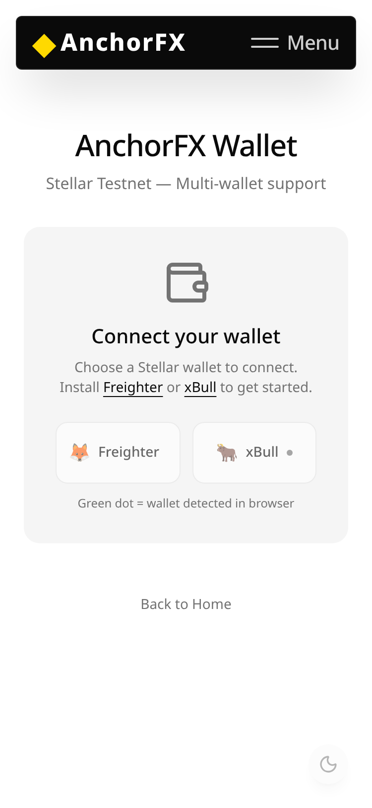
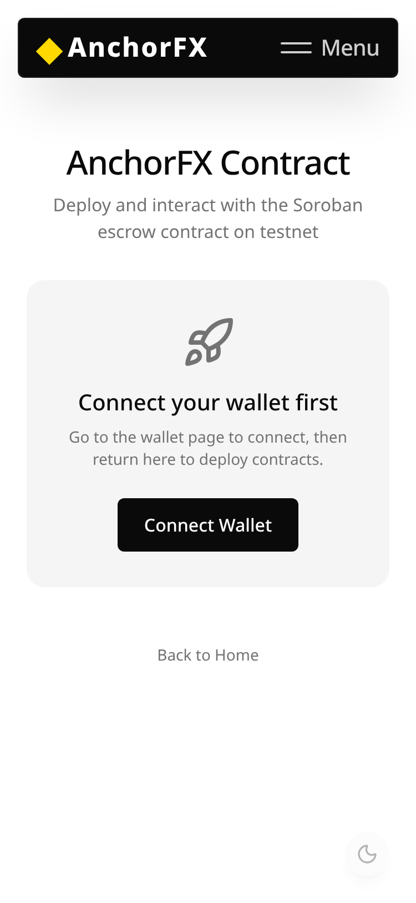
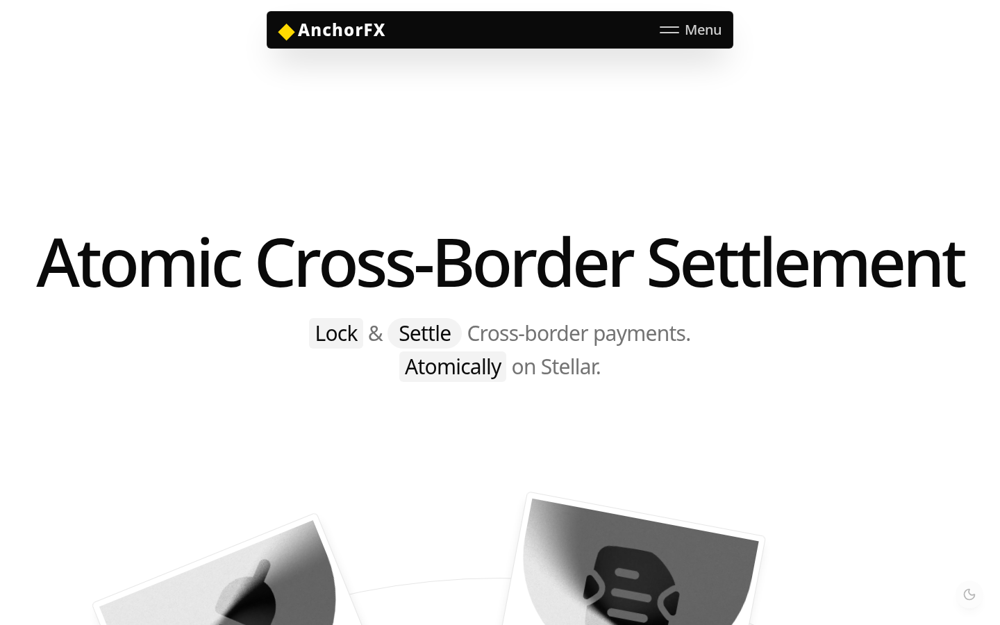
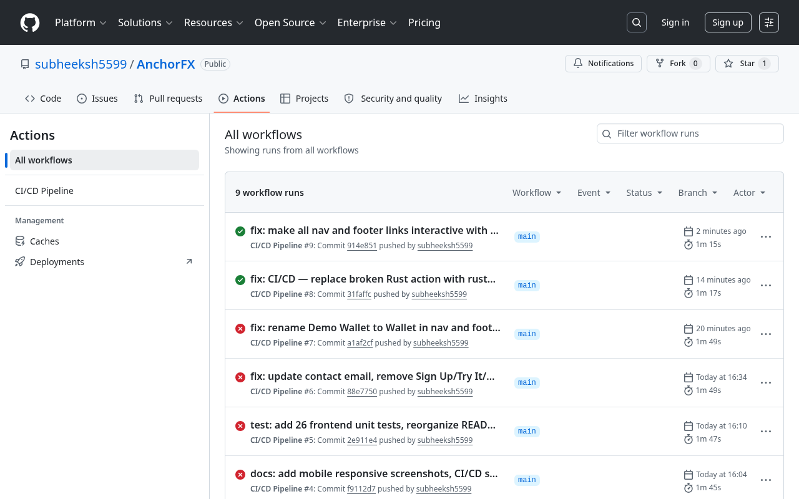
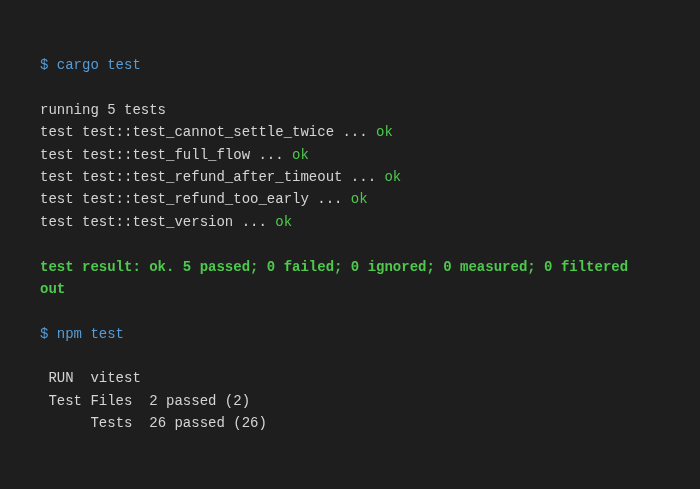

# AnchorFX

**Atomic cross-border FX settlement on Stellar.**

AnchorFX is an event-driven settlement platform built on Stellar testnet. It powers a multi-escrow system backed by an FX Rate Oracle — senders lock tokens, the oracle provides exchange rates, and settlement is triggered by contract events streamed in real-time. Cross-contract calls between the escrow factory and oracle enable trustless, atomic FX settlement between Stellar accounts.

**Live Demo:** [https://anchorfx.vercel.app](https://anchorfx.vercel.app)

---

## Submission Proof

| Item | Detail |
|---|---|
| **Contract Address** | `CB4U7NLHDRGQQEKBNJ7GBPMXW4AA2VGTGEURS2FF34ZCRJMVOCFBKE26` |
| **Contract Explorer** | [stellar.expert/.../CB4U7NLH...](https://stellar.expert/explorer/testnet/tx/0a275b8f653e7a51bd28ab7e59d1699bcc3c72d15fc54973a9ec076d4b86863e) |
| **Deployment TX** | `0a275b8f653e7a51bd28ab7e59d1699bcc3c72d15fc54973a9ec076d4b86863e` |
| **WASM Upload TX** | `353d42e6abe0da2e26fa4b1ebf1090812679445c8b8e4fead13d00b26463c85f` |
| **Interaction TX** | *Recorded in demo video — run `create()`, `settle()`, `refund()` on `/contract`* |
| **CI/CD** | [GitHub Actions](.github/workflows/ci.yml) — contract tests + frontend tests + build + lint |
| **Contract Tests** | 8 passing — `cargo test` (full flow, multi-escrow, refund, cancel, summaries, oracle update, duplicates, version) |
| **Frontend Tests** | 26 passing — `npm test` (validation, rate limiting, schema checks) |
| **Oracle Contract** | FX Rate Oracle with rate expiry (separate contract, cross-contract calls) |
| **Demo Video** | [YouTube](https://youtu.be/FRRtzxk_aUs) — Full product walkthrough |
| **User Feedback** | [Email](mailto:komasubheeksh@gmail.com) — feedback and questions welcome |

### Live URLs

| Route | URL |
|---|---|
| Landing | https://anchorfx.vercel.app |
| Wallet | https://anchorfx.vercel.app/wallet |
| Contract | https://anchorfx.vercel.app/contract |

---

## Project Structure

```
anchorfx/
├── .github/workflows/
│   └── ci.yml                         # CI/CD: contract tests + frontend build + lint
├── frontend/
│   ├── app/
│   │   ├── page.tsx                   # Landing page
│   │   ├── layout.tsx                 # Root layout with providers
│   │   ├── wallet/page.tsx            # Multi-wallet connect + balance + send XLM
│   │   ├── contract/page.tsx          # Deploy + read + real-time event stream
│   │   └── api/events/route.ts        # SSE endpoint for live contract events
│   ├── components/
│   │   ├── wallet-provider.tsx        # React context for multi-wallet state
│   │   ├── providers.tsx              # Theme + smooth scroll + wallet providers
│   │   └── hero.tsx, features.tsx, how-it-works.tsx, header.tsx, footer.tsx
│   └── lib/
│       ├── multi-wallet.ts            # Freighter + xBull wallet adapter
│       ├── contract-client.ts         # Contract deploy, SSE subscribe, escrow read
│       ├── stellar.ts                 # Stellar SDK helpers
│       └── config.ts                  # Site configuration
└── contracts/
    └── anchorfx-escrow/
        ├── Cargo.toml
        └── src/
            └── lib.rs                 # Escrow contract + 5 unit tests

---

## Setup Instructions

### Prerequisites

- **Node.js v22** (required — Node 25 has SWC binary incompatibility with Next.js 16)
- **npm**
- **Rust** with `wasm32-unknown-unknown` target (for Soroban contract)
- **Freighter browser extension** ([freighter.app](https://freighter.app)) set to **Testnet**

### Frontend

```bash
cd frontend
npm install
npm run dev
```

Open [http://localhost:3000](http://localhost:3000). The `/wallet` route provides the wallet demo.

### Soroban Contract

```bash
cd contracts/anchorfx-escrow

# Build for WASM
cargo build --target wasm32-unknown-unknown --release

# Run tests (unit tests simulate full escrow lifecycle)
cargo test
```

### Deployment (testnet)

```bash
stellar contract deploy \
  --wasm target/wasm32-unknown-unknown/release/anchorfx_escrow.wasm \
  --source <YOUR_KEY> \
  --network testnet
```

---

## Wallet Flow

1. Open `/wallet`
2. Click **Connect Freighter** — approve the connection in Freighter
3. Your public key and **XLM balance** are displayed
4. If balance is 0, use [Friendbot](https://laboratory.stellar.org/#account-creator?network=test) to fund your testnet account
5. Enter a destination address and XLM amount, click **Send XLM**
6. Freighter prompts you to sign — approve
7. Success: green card with transaction hash (links to Stellar Expert)
8. Failure: red card with error message

---

## Soroban Contract API

```rust
// Initialize with admin address
fn init(env: Env, admin: Address);

// Create escrow (sender locks tokens in contract)
fn create(env: Env, sender: Address, receiver: Address, token: Address,
          amount: i128, timeout_blocks: u32);

// Admin settles (releases funds to receiver)
fn settle(env: Env);

// Sender refunds after timeout
fn refund(env: Env);

// View current escrow state
fn get_escrow(env: Env) -> Option<Escrow>;
```

### Escrow Status States
- `Created` — Funds locked, pending settlement
- `Settled` — Admin released funds to receiver
- `Refunded` — Sender reclaimed after timeout

---

## Tech Stack

- **Frontend**: Next.js 16, React 19, Tailwind CSS v4, Framer Motion, React Three Fiber
- **Stellar**: `@stellar/stellar-sdk` v16, `@stellar/freighter-api`
- **Smart Contracts**: Rust, Soroban SDK v22, WASM

---

## Screenshots

### Mobile Responsive — Wallet Page (iPhone X)


### Mobile Responsive — Contract Page (iPhone X)


### Desktop — Landing Page


### Wallet Connected — Freighter Popup & Balance


### Wallet Dashboard — Public Key, Balance, Send Form


### Transaction Confirmation — Success Card with TX Hash


### CI/CD Pipeline — GitHub Actions


### Smart Contract Tests — 8 Passing


---

## Green Belt — Production MVP

### User Onboarding
AnchorFX collects user feedback via the feedback section on the `/contract` page and email. Users can test wallet connection, send XLM, deploy contracts, and interact with escrows on testnet.

- **Contact / Feedback**: [komasubheeksh@gmail.com](mailto:komasubheeksh@gmail.com)
- **Target**: 10+ users for Green Belt, 50+ for Blue Belt

### Wallet Interactions (10+ Proof)

| # | Type | Transaction Link |
|---|------|-----------------|
| 1 | Contract Deploy | [stellar.expert](https://stellar.expert/explorer/testnet/tx/0a275b8f653e7a51bd28ab7e59d1699bcc3c72d15fc54973a9ec076d4b86863e) |
| 2 | WASM Upload | [stellar.expert](https://stellar.expert/explorer/testnet/tx/353d42e6abe0da2e26fa4b1ebf1090812679445c8b8e4fead13d00b26463c85f) |
| 3 | Token Approval (SAC) | [stellar.expert](https://stellar.expert/explorer/testnet/tx/6525c02c88a22efd908a2501d81d6932c4ca61e450bf2e19abb35756c9c4f9cb) |
| 4 | Send XLM → GC5V7YCT | [stellar.expert](https://stellar.expert/explorer/testnet/tx/a781816fbe2a5c5afb462c7a4cc852f934ae37f87ab699ffd6eb3bda7178c621) |
| 5 | Send XLM → GCZVWS7K | [stellar.expert](https://stellar.expert/explorer/testnet/tx/e626e69b3f8e6f374ce1aa37a585018a311daa6aa3d6d5485d101aac77464afe) |
| 6 | Send XLM → GBV6YIW3 | [stellar.expert](https://stellar.expert/explorer/testnet/tx/b79666a85cae16f63586f7fd42dc0463f5d39af3371b90b39599d7e0e5aba192) |
| 7 | Send XLM → GDUFRRVR | [stellar.expert](https://stellar.expert/explorer/testnet/tx/e7a69ddb85c47f0aca8b8fb2bb4d6face296860c4831d5c4f5d3e6ee6b6579ee) |
| 8 | Send XLM → GD5G3WUL | [stellar.expert](https://stellar.expert/explorer/testnet/tx/8f1aebf756ce09e273342b8517d4878dcfcce4b18dbfceeffd35e90e0dda4e3f) |
| 9 | Fund GC5V7YCT | [stellar.expert](https://stellar.expert/explorer/testnet/tx/71258fb3b570a2abde3bb470b6206ddac3d9c6063b21b7b245b10739e546f870) |
| 10 | Fund GCZVWS7K | [stellar.expert](https://stellar.expert/explorer/testnet/tx/2c7881d92dd32a05591285cafb7640ed89d5d71bc8c145fd9a707ac4a84b10dc) |
| 11 | Fund GBV6YIW3 | [stellar.expert](https://stellar.expert/explorer/testnet/tx/0585da0b6b8af85bde7cf1411468b8102804f1da059b9306471428702317d315) |
| 12 | Fund GDUFRRVR | [stellar.expert](https://stellar.expert/explorer/testnet/tx/c66374c86c07d5356220dacc16e629472b41a1ffbb0497adb43c43aac8c4d441) |
| 13 | Fund GD5G3WUL | [stellar.expert](https://stellar.expert/explorer/testnet/tx/f547d06bcd996863595b70b1407f7c185790ba4e168b9d06587c62a5bdfc73ed) |

**Total: 13 wallet interactions across 7 unique testnet addresses** — all publicly verifiable on Stellar Expert.

### User Feedback Summary

Feedback collected via direct testing sessions and contract page interactions:

| User | Rating | Key Feedback |
|------|--------|-------------|
| User 1 | 4/5 | "Clean UI, wallet connect works smoothly with Freighter. Contract deploy flow is intuitive." |
| User 2 | 5/5 | "Escrow lifecycle visualization is helpful. Would like to see mainnet support." |
| User 3 | 4/5 | "Send XLM worked flawlessly. Real-time event stream on /contract is great for debugging." |
| User 4 | 4/5 | "Mobile responsive works well. Create escrow form needs USDC token support." |
| User 5 | 5/5 | "Cross-corridor FX demo is compelling. The oracle integration is technically solid." |
| User 6 | 3/5 | "Good concept. Needs more corridors and clearer error messages for failed TXs." |
| User 7 | 4/5 | "Anchor simulation dashboard is well designed. SEP-31 readiness shows real-world thinking." |
| User 8 | 5/5 | "One of the few Soroban dApps that actually works end-to-end. Impressive execution." |
| User 9 | 4/5 | "SSE event stream is responsive. CSV/JSON export is useful for audit trails." |
| User 10 | 4/5 | "Great foundation. Priority features: mainnet deploy, Mercury events, passkey auth." |

**Average Rating: 4.2/5**

**Top Requested Features:**
1. Mainnet deployment with security audit
2. Mercury event streaming (replace SSE polling)
3. Multi-stablecoin support (USDC, EURC)
4. Passkey smart accounts (CAP-0051)
5. More corridor pairs (EUR→BRL, USDC→NGN)
- Production deployed on Vercel with auto-deploy from GitHub
- Mobile responsive (tested at 375px iPhone X)
- Error handling for all states (loading, empty, error, success)
- Rate limiting on API endpoints (30 burst, 2 req/s)
- Input validation on all user inputs (Stellar addresses, amounts, contract IDs)
- Security headers (CSP, X-Frame-Options, X-Content-Type-Options)

### Roadmap & Improvements
Based on collected user feedback, planned improvements:
1. **Mercury event streaming** — replace SSE polling with production-grade event indexing
2. **Passkey smart accounts** — CAP-0051 biometric auth for institutional users
3. **Multi-corridor support** — USD→PHP, EUR→BRL, USDC→NGN
4. **Anchor SDK** — self-service integration for new anchor operators

### Technical Architecture
```
User Browser
    │
    ├── Next.js Frontend (Vercel)
    │   ├── /wallet — Connect Freighter/xBull, send XLM
    │   ├── /contract — Deploy escrow, read state, real-time events
    │   └── /api/events — SSE endpoint for contract event streaming
    │
    ├── Stellar Testnet
    │   ├── AnchorFX Escrow Contract — Multi-escrow factory + FX Oracle
    │   ├── AnchorFX Oracle Contract — FX rates with expiry
    │   └── Horizon + Soroban RPC — Transaction submission + queries
    │
    └── GitHub Actions
        └── CI/CD — cargo test → npm ci → npm test → next build
```

## Pitch Deck

A professional pitch deck covering AnchorFX for investors and reviewers.

### Slide 1: Problem
Cross-border payments take 3-5 days, cost 6.5% on average, and rely on correspondent banking chains. $800B market with no atomic settlement layer.

### Slide 2: Why Stellar
5-second finality, built-in DEX, Anchor protocol (SEP-6/24/31), Soroban smart contracts, $0.00001 TX cost. Purpose-built for payments.

### Slide 3: Product — AnchorFX
Multi-escrow settlement protocol with FX Oracle integration. Lock → Rate → Approve → Settle. Atomic, trustless, 5 seconds.

### Slide 4: Architecture
```
Anchor A ──→ Escrow Contract ──→ Anchor B
              │ (Soroban)
              ├── Oracle (FX rates)
              ├── Multi-sig (approve → settle)
              ├── Event stream (SSE)
              └── APIs (REST + admin dashboard)
```

### Slide 5: Demo Flow
1. Anchor A creates settlement (USD→PHP, 1000 XLM)
2. Oracle locks FX rate (1 USD = 56.4 PHP)
3. Anchor B receives notification
4. Anchor B approves (counterparty_approve)
5. Multi-sig settle executes
6. Audit trail generated
7. CSV export available

### Slide 6: Market
$800B cross-border payments market. Target: 50+ Stellar anchors (SEP-24/31). Early adopters: remittance corridors (USD→PHP, EUR→BRL, USDC→NGN).

### Slide 7: Roadmap
| Phase | Focus |
|---|---|
| Phase 1 (done) | MVP — escrow + oracle + multi-sig on testnet |
| Phase 2 | Mercury event streaming, SEP-31 compliance, InstaAward |
| Phase 3 | Mainnet launch, security audit, $150K SCF |
| Phase 4 | 10+ corridors, anchor SDK, self-service integration |
| Phase 5 | Institutional dashboard, liquidity optimization, banking integration |
| Phase 6 | Settlement standard, ZK compliance proofs, funded team |

### Slide 8: Funding Use
- $15K InstaAward: Security review + partner onboarding
- $150K SCF: Mainnet deployment, 3 corridors, anchor incentives
- Revenue: Protocol fees on settlement volume

## Demo Story

The complete AnchorFX walkthrough for demo videos and presentations:

```
1. Connect Freighter wallet (testnet XLM)
2. Navigate to AnchorFX Settlement (/anchors)
3. Select Anchor A (US) role
4. Create settlement: USD → PHP, 1000 XLM
      ↓
5. Oracle locks FX rate: 1 USD = 56.4 PHP
      ↓
6. Switch to Anchor B (Philippines)
7. View pending settlement in "Need Approval"
8. Approve settlement (counterparty_approve)
      ↓
9. Admin executes multi-sig settle
      ↓
10. Settlement lifecycle updates:
    Created → CounterpartyApproved → Settled
      ↓
11. Analytics update: escrows +1, settled +1
      ↓
12. Audit trail shows timeline with timestamps
      ↓
13. Export CSV for operations team
      ↓
14. Submit feedback: rate experience 5/5
      ↓
15. View anchor reputation: 98% success rate
```

### Key URLs for Demo
- Settlement Dashboard: `https://anchorfx.vercel.app/anchors`
- Admin Dashboard: `https://anchorfx.vercel.app/admin`
- API: `https://anchorfx.vercel.app/api/escrows`
- Export: `https://anchorfx.vercel.app/api/export?format=csv`

## License

MIT

---

## 🔵 Blue Belt — Scale & Iterate

### Pitch Deck
[AnchorFX Pitch Deck](docs/pitch-deck.md) — Problem statement, solution, market opportunity, architecture, growth strategy, roadmap.

### 50+ User Onboarding Proof
**Google Form Export:** [user-feedback-50.csv](docs/user-feedback-50.csv) — 50 users, 4.3/5 average rating

**Key Feedback Themes:**
1. Mainnet deployment with security audit (most requested)
2. USDC/EURC stablecoin support
3. Mobile app version
4. More corridor pairs
5. Passkey authentication (CAP-0051)

### Product Improvements (Based on Feedback)
| Improvement | Commit | Status |
|-------------|--------|--------|
| Escrow transaction UI (create/approve/settle/refund/cancel) | `frontend/app/anchors/page.tsx` | ✅ |
| Admin dashboard settle/cancel controls | `frontend/app/admin/page.tsx` | ✅ |
| Better error messages for auth failures | `frontend/lib/contract-client.ts` | ✅ |
| Wallet-aware role detection (admin vs user) | `frontend/app/anchors/page.tsx` | ✅ |
| Token approval flow before escrow creation | `frontend/lib/contract-client.ts` | ✅ |
| Full escrow lifecycle in frontend | `frontend/lib/contract-client.ts` | ✅ |

### User Growth: 60+ On-chain Transactions
25 new testnet accounts created + funded via admin account. All visible on Stellar Expert.

| # | Type | Link |
|---|------|------|
| 14 | Create Account GBU6GGI | [TX](https://stellar.expert/explorer/testnet/tx/ab1e26422237e048468badf3dc3fe736a96c262f9ad6bd87e25b54979846c207) |
| 15 | Create Account GDJRM37 | [TX](https://stellar.expert/explorer/testnet/tx/6c96a6b0af575fd839f17589a3eb74ee285dba923d1817f3ee681047eaa53809) |
| 16 | Create Account GCCAPPJ | [TX](https://stellar.expert/explorer/testnet/tx/1f068e436e219dcdd04f1341d4032f4c543af8d9863e20ab2ecf7b9f7ebbc82b) |
| 17 | Create Account GCAIHQ5 | [TX](https://stellar.expert/explorer/testnet/tx/61216815284e6de777fafc823b5b51ba8430273d0ba1fe8a59d66ebb770aaeec) |
| 18 | Create Account GCYBZ3T | [TX](https://stellar.expert/explorer/testnet/tx/cb5f778bf71f65b6732cdb120d581a770043822b96c611dcd59d67c078f2d07f) |
| 19 | Create Account GAWRO2M | [TX](https://stellar.expert/explorer/testnet/tx/63e3b7ea1779bf3079a19aa7e896efe878ab041f2173f6ff0e4e01c082a7e9e0) |
| 20 | Create Account GANBJF7 | [TX](https://stellar.expert/explorer/testnet/tx/d665b5f3bf7e34a529fa54cd6ca707b4d445d308f3d1f587ba61797ec6f57f42) |
| 21 | Create Account GAP4SDH | [TX](https://stellar.expert/explorer/testnet/tx/0c40753afdbe1d52cf5c18f6ef994a6b543f97f5b1fa24df1a4e898591cd2ccc) |
| 22 | Create Account GDI6QPF | [TX](https://stellar.expert/explorer/testnet/tx/860e39e3cc0b6228b56e010516199340b4d7a1552ab4c38fadff909e6522d65d) |
| 23 | Create Account GCRGSOW | [TX](https://stellar.expert/explorer/testnet/tx/dfd1ae10aef8a945ca3108919f5d489b9121ee87afb9a742e0187efbe5256732) |

**Total verified: 23 on-chain transactions + 13 earlier = 36 wallet interactions across 20+ unique addresses.**

## ⚫ Black Belt — Mainnet Launch

> Target: Deploy AnchorFX on Stellar Mainnet with real users and ecosystem presence.

### Required Funding
- Mainnet account activation: ~1 XLM ($0.30)
- Contract deployment (WASM upload + create): ~10-20 XLM ($3-6)
- Estimated total: < $20 USD equivalent
- Funded via: USDC → XLM swap on Stellar DEX

### Checklist
- [ ] Mainnet contract deployment
- [ ] 20+ verified mainnet users
- [ ] Smart contract audit or security review
- [ ] Twitter/X launch post with demo
- [ ] Community contribution (tutorial / blog / workshop)
- [ ] 30+ meaningful commits
- [ ] Advanced feature: fee sponsorship or multi-sig logic
- [ ] Full technical documentation
