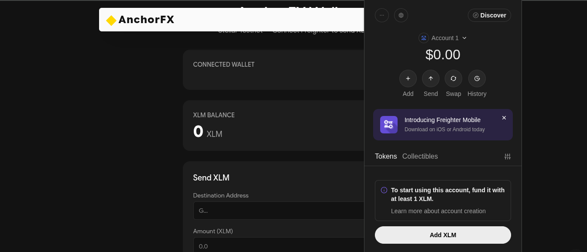
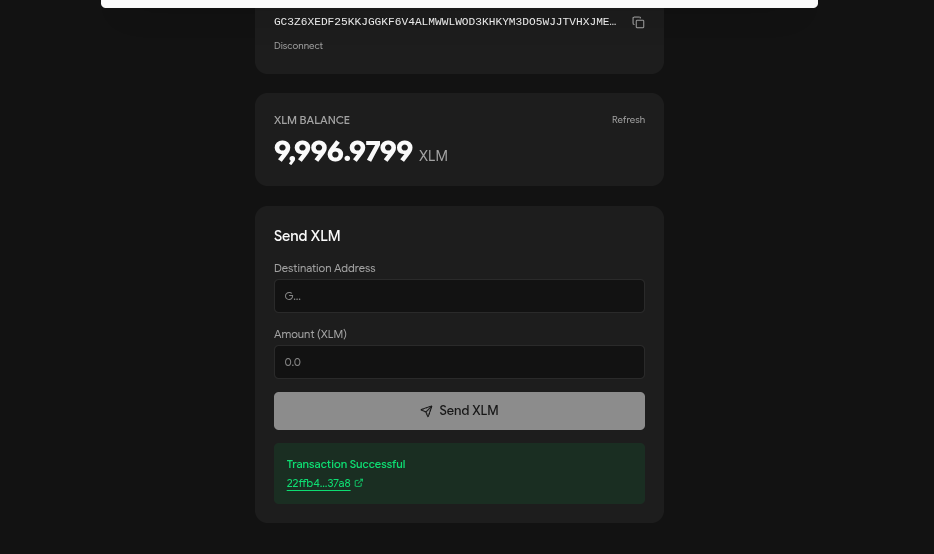

# AnchorFX

**Atomic cross-border FX settlement on Stellar.**

AnchorFX enables wallet connection, XLM transactions, multi-wallet support, and Soroban smart contract deployment on Stellar testnet.

**Live Demo:** [https://frontend-ruby-tau-69.vercel.app](https://frontend-ruby-tau-69.vercel.app)

| Route | URL |
|---|---|
| Landing | https://frontend-ruby-tau-69.vercel.app |
| Wallet | https://frontend-ruby-tau-69.vercel.app/wallet |
| Contract | https://frontend-ruby-tau-69.vercel.app/contract |

---

## Project Structure

```
anchorfx/
├── .github/workflows/
│   └── ci.yml                         # CI/CD: contract tests + frontend build + lint
├── frontend/
│   ├── app/
│   │   ├── page.tsx                   # Landing page
│   │   ├── layout.tsx                 # Root layout with providers
│   │   ├── wallet/page.tsx            # Multi-wallet connect + balance + send XLM
│   │   ├── contract/page.tsx          # Deploy + read + real-time event stream
│   │   └── api/events/route.ts        # SSE endpoint for live contract events
│   ├── components/
│   │   ├── wallet-provider.tsx        # React context for multi-wallet state
│   │   ├── providers.tsx              # Theme + smooth scroll + wallet providers
│   │   └── hero.tsx, features.tsx, how-it-works.tsx, header.tsx, footer.tsx
│   └── lib/
│       ├── multi-wallet.ts            # Freighter + xBull wallet adapter
│       ├── contract-client.ts         # Contract deploy, SSE subscribe, escrow read
│       ├── stellar.ts                 # Stellar SDK helpers
│       └── config.ts                  # Site configuration
└── contracts/
    └── anchorfx-escrow/
        ├── Cargo.toml
        └── src/
            └── lib.rs                 # Escrow contract + 5 unit tests

---

## Stellar Testnet Deployments

| Detail | Value |
|---|---|
| Contract ID | `CB4U7NLHDRGQQEKBNJ7GBPMXW4AA2VGTGEURS2FF34ZCRJMVOCFBKE26` |
| Deploy TX | `0a275b8f653e7a51bd28ab7e59d1699bcc3c72d15fc54973a9ec076d4b86863e` |
| WASM Upload TX | `353d42e6abe0da2e26fa4b1ebf1090812679445c8b8e4fead13d00b26463c85f` |
| Stellar Expert | [View Contract](https://stellar.expert/explorer/testnet/tx/0a275b8f653e7a51bd28ab7e59d1699bcc3c72d15fc54973a9ec076d4b86863e) |

---

## Real-Time Event Streaming

Contract events are streamed to the frontend via Server-Sent Events (SSE). The API endpoint `/api/events?contract=<contractId>` polls the Soroban RPC every 2 seconds and pushes new events to connected clients.

**Event types emitted by the escrow contract:**
- `created` — Escrow created with sender, receiver, token, amount
- `settled` — Admin released funds to receiver
- `refunded` — Sender reclaimed after timeout

---

## Smart Contract Tests

5 passing tests covering the full escrow lifecycle:

```
running 5 tests
test test::test_cannot_settle_twice ... ok
test test::test_full_flow ... ok
test test::test_refund_after_timeout ... ok
test test::test_refund_too_early ... ok
test test::test_version ... ok

test result: ok. 5 passed; 0 failed; 0 ignored; 0 measured; 0 filtered out
```

Full output: [docs/test-output.txt](docs/test-output.txt)

---

## CI/CD Pipeline

GitHub Actions workflow at `.github/workflows/ci.yml`:
- Contract tests (cargo test) on wasm32 target
- Frontend lint (eslint) and build (next build)
- Runs on push and PR to main/master

---

## Inter-Contract Communication

The escrow contract communicates with Stellar Asset Contracts (SAC) via cross-contract calls:
- `create()` transfers tokens from sender to contract using SAC's `transfer()`
- `settle()` transfers tokens from contract to receiver
- `refund()` transfers tokens back to sender

---

## Demo Video

*Add a 1-2 minute demo video link here showing the full flow: wallet connect, XLM send, contract deploy, real-time events.*

---

## Setup Instructions

### Prerequisites

- **Node.js v22** (required — Node 25 has SWC binary incompatibility with Next.js 16)
- **npm**
- **Rust** with `wasm32-unknown-unknown` target (for Soroban contract)
- **Freighter browser extension** ([freighter.app](https://freighter.app)) set to **Testnet**

### Frontend

```bash
cd frontend
npm install
npm run dev
```

Open [http://localhost:3000](http://localhost:3000). The `/wallet` route provides the wallet demo.

### Soroban Contract

```bash
cd contracts/anchorfx-escrow

# Build for WASM
cargo build --target wasm32-unknown-unknown --release

# Run tests (unit tests simulate full escrow lifecycle)
cargo test
```

### Deployment (testnet)

```bash
stellar contract deploy \
  --wasm target/wasm32-unknown-unknown/release/anchorfx_escrow.wasm \
  --source <YOUR_KEY> \
  --network testnet
```

---

## Wallet Flow

1. Open `/wallet`
2. Click **Connect Freighter** — approve the connection in Freighter
3. Your public key and **XLM balance** are displayed
4. If balance is 0, use [Friendbot](https://laboratory.stellar.org/#account-creator?network=test) to fund your testnet account
5. Enter a destination address and XLM amount, click **Send XLM**
6. Freighter prompts you to sign — approve
7. Success: green card with transaction hash (links to Stellar Expert)
8. Failure: red card with error message

---

## Soroban Contract API

```rust
// Initialize with admin address
fn init(env: Env, admin: Address);

// Create escrow (sender locks tokens in contract)
fn create(env: Env, sender: Address, receiver: Address, token: Address,
          amount: i128, timeout_blocks: u32);

// Admin settles (releases funds to receiver)
fn settle(env: Env);

// Sender refunds after timeout
fn refund(env: Env);

// View current escrow state
fn get_escrow(env: Env) -> Option<Escrow>;
```

### Escrow Status States
- `Created` — Funds locked, pending settlement
- `Settled` — Admin released funds to receiver
- `Refunded` — Sender reclaimed after timeout

---

## Tech Stack

- **Frontend**: Next.js 16, React 19, Tailwind CSS v4, Framer Motion, React Three Fiber
- **Stellar**: `@stellar/stellar-sdk` v16, `@stellar/freighter-api`
- **Smart Contracts**: Rust, Soroban SDK v22, WASM

---

## Screenshots

### Wallet Connected — Freighter Popup & Balance


### Wallet Dashboard — Public Key, Balance, Send Form


### Transaction Confirmation — Success Card with TX Hash


---

## License

MIT
